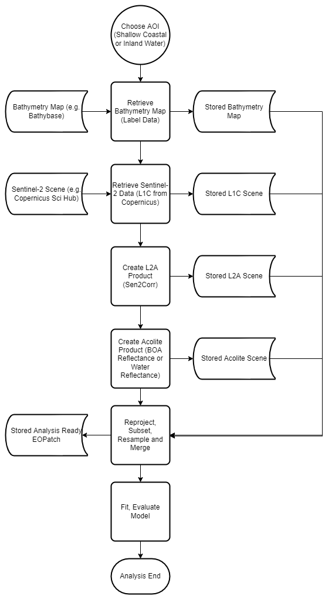

# Evaluation of Preprocessing Methods of Sentinel-2 Data and their Impact on Traditional Empirical and Modern Machine Learning Based Satellite Derived Bathymetry Methods

The goal of this project is to look at the influence of different preprocessing methods for Sentinel-2 data products and
their influence on traditional algorithms like the Stumpf Log-Ratio Method (Stumpf et al., 2003) in contrast to modern
approaches like LightGBM (Ke et al., 2017).

## ⚠ WIP Warning ⚠

As of now the conference paper still needs to be published and linked to this repository.

## Bit Rot Disclaimer

While I tried to make sure that everything in this repository can be inspected and executed by interested readers, I am aware that
after a while newer Python and package versions will break the project's code. I provide an `environment.yml` file that documents
the exact versions of all dependencies I used on my system. I also documented each notebook in a way that should make the intention
of each step very clear, so that even if a reader wants to migrate the complete analysis or just parts to another language or environment,
this can be done even without using the provided code.

## Analysis Areas of Interest

The analysis looks at three different areas:

- Section of shallow ocean water near the north-west corner
  of the Bahamas `BBox: (25.23467352,-78.43272685,25.31877266,-78.23940804)`
- Section of shallow ocean water the west coast of Puerto Rico
  `BBox: (18.14442526,-67.24112119,18.17335221,-67.18944271)`
- [Mille Lacs Lake](https://en.wikipedia.org/wiki/Mille_Lacs_Lake) in Minnesota, USA
  `BBox: (46.099296265601545,-93.83878319721899,46.377612102131366,-93.44756526336063)`

## Analysis Data

The data used for this environment consists of:

- Shapefiles for certain AOIs created in QGIS
- Bathymetry maps from various sources
- Sentinel-2 L1C scenes and derived L2A and Acolite products

The data needed to reproduce this analysis will be shared with the accompanying paper on Zenodo.

The Bathymetry Sources are:

- Mille Lacs Lake: [Lakes Data for Minnesota](https://www.mngeo.state.mn.us/chouse/water_lakes.html)
  [Bathybase Entry](http://www.bathybase.org/Data/800-899/895/)
- Puerto Rico: Grid Export [NOAA NCEI Data Viewer](https://www.ncei.noaa.gov/maps/bathymetry/)
- Bahamas: handed down from previous project. The source reference is unfortunately lost.

## Computing Environment

This project was mainly executed on a Laptop PC (Lenovo ThinkPad E14 Gen 2, Intel Core(TM) i7-1165G7, 32 GB RAM, Windows 10 21 H2).
While especially the modelling notebooks can make good use of additional CPU resources a machine with lower specs should be still
sufficient to repeat all processing steps. Windows users should be able to directly recreate the
[conda](https://docs.conda.io/en/latest/) from the `environment.yml` file in this repository. Linux and macOS users will need to
adapt the environment as some transitive dependencies are currently locked at Windows specific versions.

## Interpretation of Notebook Order

In the `notebooks` directory of this repository you will find numerated Jupyter Notebooks which can be subdivided into the following
process steps:

- Bathymetry Map Preprocessing (
  [00 - Puerto Rico](notebooks/00__preparing_puerto_rico_bathy_aoi.ipynb),
  [01 - Bahamas](notebooks/01__preparing_bahamas_bathy_aoi.ipynb),
  [02 - Mille Lacs Lake](notebooks/02__preparing_mille_lacs_bathy_aoi.ipynb))
- Sentinel-2 Data Preprocessing and Dataset Merge (
  [03 - Puerto Rico](notebooks/03__dataset_preparation_puerto_rico.ipynb),
  [04 - Bahamas](notebooks/04__dataset_preparation_bahamas.ipynb),
  [05 - Mille Lacs Lake](notebooks/05__dataset_preparation_mille_lacs.ipynb))
- Stumpf Log-Regression Fitting and Evaluation (
  [06 - Puerto Rico](notebooks/06__stumpf_log_regression_puerto_rico.ipynb),
  [07 - Bahamas](notebooks/07__stumpf_log_regression_bahamas.ipynb),
  [08 - Mille Lacs Lake](notebooks/08__stumpf_log_regression_mille_lacs.ipynb))
- LightGBM Fitting and Evaluation (
  [09 - Puerto Rico](notebooks/09__lgbm_calibration_puerto_rico.ipynb),
  [10 - Bahamas](notebooks/10__lgbm_calibration_bahamas.ipynb),
  [11 - Mille Lacs Lake](notebooks/11__lgbm_calibration_mille_lacs.ipynb))

Each notebook includes a detailed description of the current context and each taken step. I tried to document each notebook in a way
that they can also be read in isolation. In some instances (especially when comparing results) I add references to other notebooks.
If you wish to read a more condensed writeup of the project please feel free to follow the link to my conference paper.

## Python Sources

While working on this project I produced a rather generic `eolearn_extras` module which contains some eo-learn tasks which could
be useful to others and a less generic collection of helper code in the `notebooks/sdb_utils` directory. All the code is available
freely under the MIT license. If you find any bugs or need further assistance please don't hesitate to open an issue.

## Approach

The general analysis approach can be seen in <a href="#fig-1">Figure 1</a>. As both the traditional as well as the modern model
are supervised learning algorithms we need to provide ground truth values for training. Those values can be extracted from
bathymetry maps which represent the depth profile (or underwater topography) of areas of inland or ocean water.
Two possible repositories are [Bathybase](http://www.bathybase.org/) and the National Oceanic and Atmospheric
Administration's (NOAA) National Centers for Environmental Information (NCEI)
[bathymetry portal](https://www.ncei.noaa.gov/maps/bathymetry/).

For a given area of interest (AOI) which either includes the extent of the whole bathymetry map or a particular subsection
we search for Sentinel-2 scenes which contain the AOI at a time with no cloud obstruction and - in the case of regions which
experience low temperatures - no ice formation. Once a fitting scene is found we download the complete Standard Archive
Format for Europe (SAFE) archive and store it for further preprocessing. It is essential not to use partial downloads
(e.g. with the [sentinelsat](https://sentinelsat.readthedocs.io/en/stable/index.html) Python package) because further
preprocessing methods assume that the SAFE archives are complete.

In this project two preprocessing methods for atmospheric correction are evaluated against the top of atmosphere (TOA)
L1C product. One is the L2A product generated by using the Sen2Cor processor (Main-Knorn et al., 2017) while the other
is the resulting data product produced by applying the [Acolite](https://github.com/acolite/acolite)
(Vanhellmont and Ruddick, 2016) processor.
<a href="#table-1">Table 1</a> shows the exact version of the used operating system (OS) as well as the versions of the
processors.

| Software   | Version                                                     |
| ---------- | ----------------------------------------------------------- |
| Windows OS | 21H2 Build 19044.1706                                       |
| Sen2Cor    | 2.10.01-win64                                               |
| Acolite    | Generic Git - Hash dafc2d4bced4864f0bc111b9e0d3348ff16a5336 |

    <b id="table-1">Table 1: Used software for executing preprocessor</b>

All further processing of the acquired raster images to create analysis ready data (ARD) is done using
the [eo-learn framework](https://eo-learn.readthedocs.io/en/latest/). You can fnd a detailed description of all
steps for data preprocessing, modelling and model evaluation in the notebooks folder of this repository.

    <b id="fig-1">Fig 1: General analysis approach</b>

